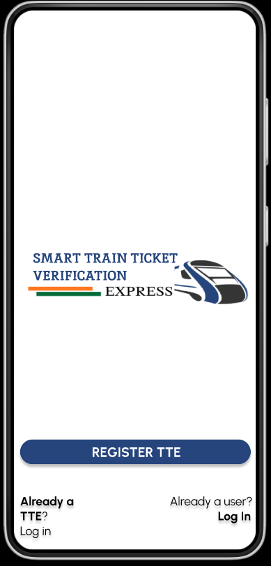
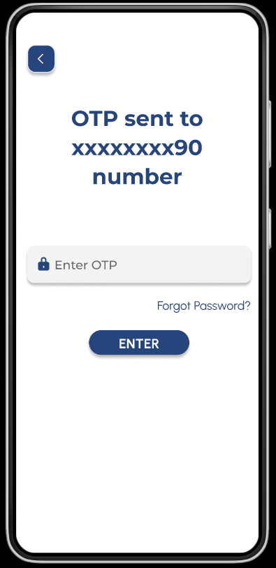
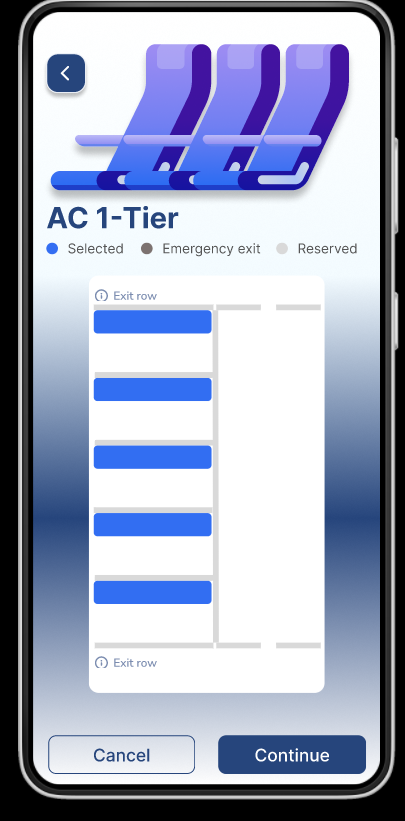
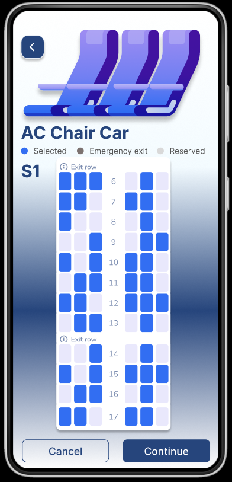
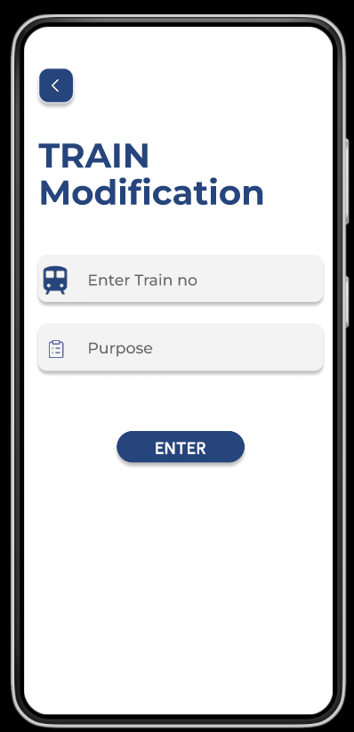
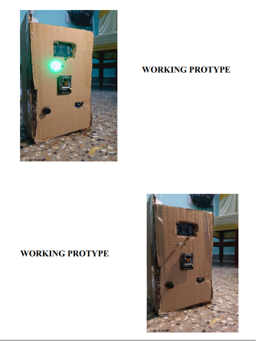
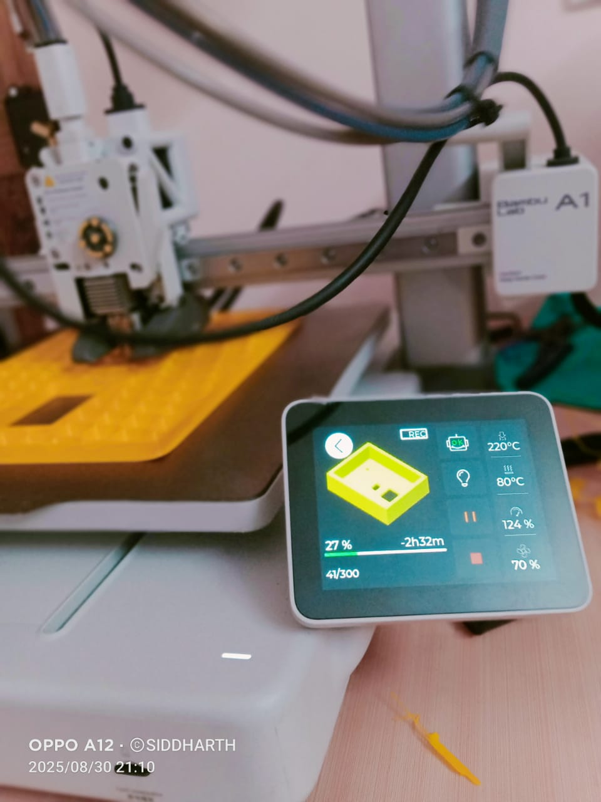
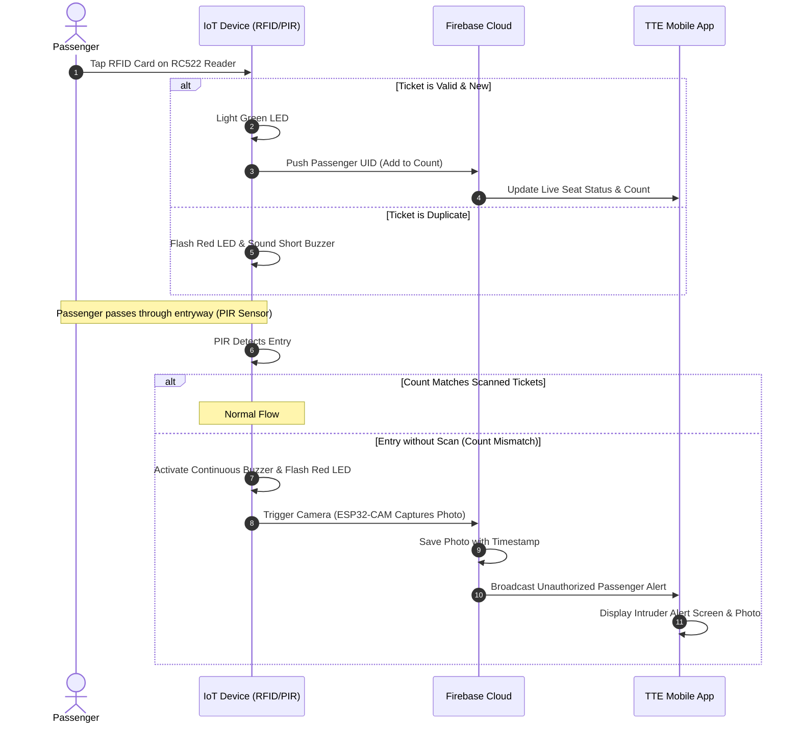

# Smart Train Ticket Verification System (SMTTVS)


An automated, IoT-enabled passenger ticket validation and unauthorized entry prevention system. Designed for the Smart India Hackathon (SIH 2025) under the Transportation & Logistics theme, this system streamlines Traveling Ticket Examiner (TTE) workflows, prevents revenue leakage, and enhances train security.

---

## Table of Contents

- [Executive Summary](#executive-summary)
- [System Architecture](#system-architecture)
- [Key Features](#key-features)
- [Hardware Architecture & Schematic](#hardware-architecture--schematic)
- [Software Interface & User Journey](#software-interface--user-journey)
- [Prototype & Installation](#prototype--installation)
- [System Workflow](#system-workflow)
- [Setup & Installation Guide](#setup--installation-guide)
- [Future Enhancements](#future-enhancements)
- [Developer & License](#developer--license)

---

## Executive Summary

Indian railway ticket inspection is predominantly manual, leading to delays, human errors, fare evasion, and limited real-time visibility of passenger compliance. 

The **Smart Train Ticket Verification System (SMTTVS)** offers a modern, automated solution:
1. **Contactless Validation:** Incorporates RFID/NFC technology for instant, tap-based passenger validation as they board.
2. **Unauthorized Passenger Detection:** Utilizes passive infrared (PIR) sensors at entry points to track passengers and compare actual boarding events against scanned tickets.
3. **Automated Evidence Collection:** Deploys an ESP32-CAM to capture images of passengers who board without scanning, uploading evidence to a Firebase Realtime Database.
4. **TTE Assistant Application:** Features a mobile-friendly dashboard where TTEs can monitor compartment capacity, seat availability, view logs, and issue fines.

---

## System Architecture

The project consists of three integrated layers:
- **Physical Layer (IoT Node):** Coordinates the microcontroller (Arduino/ESP32), RFID scanner, motion detector, OLED readout, and warning alarms.
- **Cloud Database (Firebase):** Syncs card credentials, passenger counts, compartment states, and image uploads securely.
- **Client Application (Web & Mobile HTML5/CSS3/JS):** Displays live compartment occupancy and unauthorized entry alerts to the TTE.

```
+-------------------------------------------------------------+
|                      Hardware IoT Node                      |
|  [RFID RC522]       [PIR Sensor]      [OLED SSD1306 Display]  |
|         \                /                      /           |
|          v              v                      v            |
|       +--------------------------------------------+        |
|       |             Arduino / ESP32                |        |
|       |  - Validates card data locally             |        |
|       |  - Matches entries vs scans                |        |
|       |  - Controls local buzzers & LEDs           |        |
|       +--------------------------------------------+        |
|                              |                              |
|                              v                              |
|                      [ESP32-CAM Node]                       |
|          - Captures visual proof of alerts                  |
+------------------------------|------------------------------+
                               |
                        Wi-Fi Transfer
                               |
                               v
+-------------------------------------------------------------+
|                      Firebase Cloud                         |
|         - Realtime Database (Passenger Logs)                |
|         - Cloud Storage (Captured Evidence)                 |
+------------------------------|------------------------------+
                               |
                        Websocket Sync
                               |
                               v
+-------------------------------------------------------------+
|                       TTE Dashboard                         |
|      - Mobile Web Client (Real-time updates & Alerts)       |
+-------------------------------------------------------------+
```

---

## Key Features

- **Tap-and-Go Validation:** Uses RFID RC522 scanners to instantly read and record ticket data from RFID tags.
- **Smart Occupancy Tracking:** Continuously monitors passenger counts inside coaches using PIR motion sensors.
- **Proactive Intrusion Detection:** Automatically triggers visual and auditory alerts (Red LED & Buzzer) when a passenger bypasses the RFID scanner.
- **Visual Evidence Upload:** Activates the ESP32-CAM upon unauthorized entry detection to log security photos directly to Firebase.
- **Digital Seat Mapping:** Visually represents seat booking across General, Sleeper, and AC classes (1-Tier, 2-Tier, 3-Tier, and Chair Car) so the TTE knows exactly which seats are empty.
- **TTE Mobile Portal:** A responsive application that enables TTEs to take charge of a specific train run, review compartment passenger details, and administer fine cards.

---

## Hardware Architecture & Schematic

The central prototype coordinates inputs and outputs via defined GPIO pins. Below is the pinout configuration for the primary Arduino/ESP32 subsystem:

| Peripheral | Component Pin | Microcontroller Pin | Description |
|---|---|---|---|
| **RFID Reader (MFRC522)** | SDA (SS) | Pin 10 | SPI Chip Select |
| | RST | Pin 9 | SPI Reset |
| | SCK | Pin 13 | SPI Serial Clock |
| | MISO | Pin 12 | SPI Master In Slave Out |
| | MOSI | Pin 11 | SPI Master Out Slave In |
| | VCC | 3.3V | Power Supply |
| | GND | GND | Ground Reference |
| **Motion Sensor** | PIR Output | Pin 8 | Digital Input for Passenger Entry |
| **Indicators** | Green LED | Pin 7 | Digital Output for Successful Scan |
| | Red LED | Pin 6 | Digital Output for Duplicate / Anomaly |
| | Buzzer | Pin 5 | Digital Output for Intruder Alarm |
| **OLED (SSD1306)** | SDA | A4 (SDA) | I2C Data Line (Address: `0x3C`) |
| | SCL | A5 (SCL) | I2C Clock Line |

---

## Software Interface & User Journey

### TTE Authentication & Entry Flow
The TTE signs up, logs in, and enters their credentials along with the train code. An OTP validation completes the sequence to prevent unauthorized database access.

| Splash Screen | Registration & Login | OTP Verification |
|---|---|---|
|  | <br><br> |  |

---

### Dashboard & Control
Once authorized, the TTE can take charge of the coach, monitor total occupant counts, and view real-time compartment status updates.

| Take Charge Module | Main Dashboard | Compartment Details |
|---|---|---|
|  |  |  |

---

### Coach Seat Management Layouts
The system provides tailored seat maps for different classes, reflecting actual vs booked seats to guide the TTE to empty berths.

| General | Sleeper | AC 3-Tier |
|---|---|---|
|  |  |  |

| AC 2-Tier | AC 1-Tier | Chair Car |
|---|---|---|
|  |  |  |

---

### Intrusion & Modifications
When a passenger bypasses ticket verification, an instant red flag alert displays on the TTE's dashboard. In addition, the TTE can use the Train Modification module to dynamically configure coaches.

| Unauthorized Entry Alert | Coach Configuration Module |
|---|---|
|  |  |

---

## Prototype & Installation

### Hardware System Integration
The circuit board fits inside a custom 3D-printed enclosure mounted directly adjacent to the train coach entrance door, allowing passengers to scan tickets as they cross the threshold.

| Prototype Case Enclosure | RFID Verification Point |
|---|---|
|  |  |

| 3D Printing Production | Onboard Train Integration |
|---|---|
| <br><br> |  |

---

## System Workflow

The following sequential model diagrams the system verification process for passenger boarding:



---

## Setup & Installation Guide

### Hardware Configuration (Arduino Sketch)
1. **Prerequisites:** Install [Arduino IDE](https://www.arduino.cc/en/software).
2. **Library Installation:** Use the Arduino Library Manager to install:
   - `MFRC522` (RFID Library)
   - `Adafruit SSD1306` (OLED Library)
   - `Adafruit GFX Library`
3. **Pin Configuration:** Ensure standard SPI pin connections match the hardware architecture table.
4. **Flashing Firmware:**
   - Open `/Arduino code/final_Train/final_Train.ino` in Arduino IDE.
   - Set target board (e.g., Arduino Uno or ESP32 NodeMCU).
   - Click **Upload**.
5. **Serial Monitor:** Open the Serial Monitor at `9600` baud rate to inspect system diagnostics.

### Software Configuration (Web Portal)
To test the web portal interface locally:
1. Open the project root.
2. Locate the `/website/home/index.html` file or `/smart-tte-app/index.html` (mobile layout).
3. Open either file directly in any modern browser.
4. Open the Browser DevTools Console (F12) to trace interactions.

---

## Future Enhancements

- **Artificial Intelligence Integration:** Train an object recognition model on the ESP32-CAM to classify passenger luggage and identify hazardous items.
- **Automatic Fare Collection (AFC):** Connect directly to government API endpoints (such as CRIS or IRCTC) to automatically charge passenger credit balances or deduct fines.
- **Biometric Backup:** Integrate fingerprint or facial scanning alongside RFID cards for enhanced security.
- **LoRaWAN / Cellular Fallback:** Add low-power wide-area network nodes to transmit passenger updates even in remote regions with poor internet access.

---

## Developer & License

### Project Developer
**Siddharth B**
- Specialization: Software Engineering / IoT Development / Full Stack Web Development
- Team: Social Workers (Smart India Hackathon Entry)

### License
This system is created and maintained for academic development, research, and innovation review purposes.
